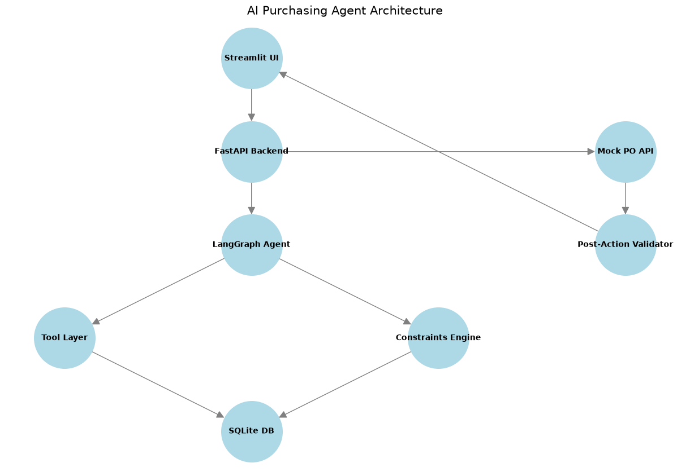

# AI Purchasing Agent

**Live Demo:** [https://demo-ai-purchasing-agent.streamlit.app/](https://demo-ai-purchasing-agent.streamlit.app/)

An autonomous procurement operations assistant designed for retail and quick-commerce environments. Built with LangGraph, Google Gemini, FastAPI, and Streamlit, the agent reviews untrusted replenishment recommendations, gathers multi-source operational data, strictly enforces deterministic physical and financial constraints (in ₹ INR), gates risky actions behind human approval, autonomously executes purchase orders, and verifies outcomes through closed-loop post-action validation.

---

## What It Does

In retail and quick-commerce, automated replenishment models frequently propose purchase orders that violate physical storage constraints, exceed working capital budgets, or ignore supplier capacity limits. 

The **AI Purchasing Agent** acts as an operational co-pilot for buyers and procurement managers:
1. **Ingests Untrusted Proposals**: Takes raw purchasing recommendations (`Product ID`, `Supplier ID`, `Requested Qty`) from demand forecasting systems.
2. **Investigates Context**: Automatically queries real-time inventory levels, sales velocity, supplier lead times, minimum order quantities (MOQ), warehouse storage capacity, and available budget.
3. **Applies Deterministic Rules**: Evaluates hard operational constraints in pure Python before invoking the LLM. The LLM cannot override mathematics or bypass feasibility limits.
4. **Reasons & Decides**: Uses Google Gemini to analyze trade-offs and produce structured decisions: `ACCEPT`, `MODIFY`, `REJECT`, or `INVESTIGATE`.
5. **Enforces Human-in-the-Loop (HITL)**: Requires human supervisor sign-off for any modified quantities or high-risk actions.
6. **Executes & Validates**: Creates purchase order records through a centralized service and immediately verifies actual execution against intended quantities to detect discrepancies or supplier under-fulfillment.

---

## Architecture & Design Principles



### 1. Untrusted Proposal Pattern
Recommendations coming into the procurement system are treated strictly as *untrusted proposals*. The agent never executes an order blindly; it treats the proposal as a hypothesis to be verified against live operational data.

### 2. LLM vs. Deterministic Logic
We maintain a strict separation of concerns:
* **LLMs** handle semantic reasoning, contextual synthesis, qualitative risk assessment, and explaining trade-offs.
* **Deterministic Python Code** handles mathematical calculations, quantity constraints, financial caps, and execution permissions.
The LLM is never allowed to perform unconstrained calculations or authorize expenditures outside hard bounds.

### 3. Hard Constraint Enforcement
The constraint engine evaluates five non-negotiable boundaries:
* **Budget Limits (₹)**: Ensures total purchase cost does not exceed the remaining procurement budget (₹10,00,000 baseline).
* **Storage Capacity**: Validates that projected inventory volume does not exceed available warehouse space.
* **Supplier Capacity**: Confirms the supplier has sufficient stock to fulfill the order.
* **Minimum Order Quantity (MOQ)**: Ensures orders satisfy supplier order minimums.
* **Demand Justification**: Flags orders exceeding 150% of forecasted demand.

If any constraint is breached, the engine deterministically computes the `max_feasible_qty`. If an LLM proposes an unsafe quantity exceeding this limit, Python-level safety clamps automatically override the LLM.

### 4. Human-in-the-Loop (HITL) Approval Gate
* **`ACCEPT`**: Fully compliant orders within limits execute autonomously.
* **`MODIFY`**: Quantities adjusted due to constraint breaches or supplier limitations require explicit human approval via the dashboard.
* **`REJECT` & `INVESTIGATE`**: Non-executing outcomes that block order creation deterministically.

### 5. Closed-Loop Validation
Creating a purchase order record is not the end of the workflow. The post-action validator inspects the actual database record post-execution and compares it to intended values:
* **`VALID`**: Exact match between intended and fulfilled quantities.
* **`PARTIALLY_VALID`**: Supplier fulfilled less than ordered; logs the shortfall delta.
* **`INVALID`**: Mismatches in supplier, product, or unexpected errors.

---

## End-to-End Workflow

```text
Recommendation (Untrusted Proposal)
       │
       ▼
Investigation (Tool Layer) ──▶ Queries Inventory, Demand, Suppliers, Budget, Storage
       │
       ▼
Deterministic Constraints ──▶ Calculates max_feasible_qty, flags violations (Budget, Storage, MOQ)
       │
       ▼
Agent Decision (LLM) ──▶ Structured Output: ACCEPT | MODIFY | REJECT | INVESTIGATE
       │
       ▼
Approval Gate ──▶ Only MODIFY requires human sign-off; REJECT/INVESTIGATE blocked
       │
       ▼
Purchase Order Execution ──▶ Centralized service writes PO record to database
       │
       ▼
Post-Action Validation ──▶ Closed-loop check: VALID | PARTIALLY_VALID | INVALID
       │
       ▼
Audit Trace & Logs ──▶ Full lifecycle timestamps and operational telemetry
```

---

## Scenarios Handled

The evaluator demo highlights two primary procurement scenarios:

| Scenario | Recommendation | Constraint State | Decision | Action & Validation |
|:---|:---|:---|:---:|:---|
| **1. Fully Feasible** | `SKU-003`, `SUP-002`, 300 units | All constraints satisfied | `ACCEPT` | Autonomously executed $\rightarrow$ `VALID` (100% match) |
| **2. Storage Breach** | `SKU-001`, `SUP-001`, 800 units | Warehouse space permits only 500 | `MODIFY` (500) | Clamped $\rightarrow$ Human Approval $\rightarrow$ Executed as 300 (demo) $\rightarrow$ `PARTIALLY_VALID` |

---

## Demo Walkthrough

### Scenario 1 — Successful Purchase (Autonomous Happy Path)
1. **Input**: Evaluator selects `Scenario 1 — Fully Feasible` (`SKU-003`, `SUP-002`, 300 units).
2. **Investigation**: Shows available budget (₹10,00,000), storage capacity (1,000 units), and supplier stock (5,000 units).
3. **Constraints**: All checks pass (`Budget: PASS`, `Storage: PASS`, `Supplier: PASS`, `MOQ: PASS`). Max feasible quantity is 300.
4. **Decision**: Agent outputs `ACCEPT` with 300 units.
5. **Execution & Validation**: Executes autonomously without waiting for human approval. Post-action validation confirms `VALID` with 0 shortfall.

### Scenario 2 — Constraint + Approval + Partial Execution
1. **Input**: Evaluator selects `Scenario 2 — Storage Breach` (`SKU-001`, `SUP-001`, 800 units).
2. **Investigation**: Warehouse storage capacity is 600 units with 100 already utilized; only 500 units can physically fit.
3. **Constraints**: Fails storage check (`Storage: FAIL`). Deterministic engine sets `max_feasible_qty = 500`.
4. **Decision**: Agent outputs `MODIFY` with 500 units, explaining warehouse constraints.
5. **Human Approval Gate**: The UI pauses execution and displays an operational approval card showing reduction from 800 $\rightarrow$ 500 units.
6. **Execution**: Evaluator clicks `✔ Approve & Execute`.
7. **Partial Fulfillment Detection**: The simulated supplier fulfills 300 units out of 500. The validator flags the outcome as `PARTIALLY_VALID` with an explicit alert: `Shortfall: 200 units (Expected 500, Actual 300)`.

---

## Tech Stack

* **Language**: Python 3.11+
* **Orchestration**: [LangGraph](https://github.com/langchain-ai/langgraph) (cyclical state graph with progressive node streaming)
* **LLM Engine**: Google Gemini (`gemini-flash-latest`) via `langchain-google-genai` with automated 4-model fallback chain (`gemini-flash-lite-latest` $\rightarrow$ `gemini-3.5-flash-lite` $\rightarrow$ `gemma-4-31b-it`)
* **API Layer**: [FastAPI](https://fastapi.tiangolo.com/) (REST endpoints for PO creation and validation)
* **Dashboard**: [Streamlit](https://streamlit.io/) (dark-themed operations console with real-time progressive streaming)
* **Database & ORM**: SQLite with [SQLAlchemy](https://www.sqlalchemy.org/)
* **Schema Validation**: [Pydantic v2](https://docs.pydantic.dev/) (strict structured outputs and boundary enforcement)
* **Testing**: [Pytest](https://docs.pytest.org/) (deterministic offline suites and scenario evaluators)
* **Containerization**: Docker

---

## Project Structure

```text
ai-purchasing-agent/
├── app/
│   ├── agents/
│   │   ├── prompts.py              # LLM system instructions & guidelines
│   │   ├── purchasing_agent.py     # LangGraph nodes & structured AgentDecision schema
│   │   └── state.py                # TypedDict workflow state definition
│   ├── api/
│   │   └── routes.py               # FastAPI REST endpoints for POs
│   ├── db/
│   │   ├── database.py             # SQLAlchemy models & connection sessionmaker
│   │   └── seed.py                 # Idempotent DB seeder with INR currency migration
│   ├── rules/
│   │   ├── constraints.py          # Deterministic Python constraint engine & INR formatter
│   │   └── validator.py            # Closed-loop post-action execution validator
│   ├── services/
│   │   └── purchasing_service.py   # Centralized PO execution service & streaming generator
│   └── tools/                      # Tool functions (inventory, demand, supplier, budget, storage)
├── data/
│   └── seed.json                   # Mock procurement dataset (INR currency values)
├── docs/
│   ├── architecture.png            # Visual architecture diagram
│   └── generate_arch.py            # Script to generate architecture diagram
├── frontend/
│   └── dashboard.py                # Streamlit operations console (progressive streaming)
├── tests/
│   ├── run_eval.py                 # Live evaluation grading runner (Accuracy, Constraints, Validation)
│   ├── test_constraints.py         # Unit tests for deterministic rules & divide-by-zero guards
│   ├── test_execution_safety.py    # Unit tests for session lifecycle, safety clamps & approval gates
│   ├── test_scenarios.py           # End-to-end integration tests for the 5 scenarios
│   └── test_validation.py          # Unit tests for post-action fulfillment validator
├── .env.example                    # Environment variable template
├── Dockerfile                      # Production container recipe
├── main.py                         # FastAPI backend launcher with lifespan DB seeder
├── pytest.ini                      # Pytest config isolating live LLM tests by default
└── requirements.txt                # Pinned production dependencies
```

---

## Setup & Run Instructions

### Prerequisites
* Python 3.11+
* A Google Gemini API Key ([Google AI Studio](https://aistudio.google.com/))

### Installation
```bash
python -m venv venv
# On Windows:
venv\Scripts\activate
# On Linux/macOS:
source venv/bin/activate

pip install -r requirements.txt
```

### Environment Configuration
Copy the example environment file and add your Google Gemini API key:
```bash
cp .env.example .env
```
Inside `.env`:
```ini
GOOGLE_API_KEY=your_google_api_key_here
MODEL_NAME=gemini-flash-latest
DATABASE_URL=sqlite:///./purchasing_agent.db
```

### Running Locally

#### 1. Streamlit Operations Dashboard
```bash
streamlit run frontend/dashboard.py
```
*The database automatically initializes and seeds with INR mock data on first launch.*

#### 2. FastAPI Backend Service (Optional)
```bash
python main.py
```
API documentation is available at `http://localhost:8000/docs`.

### Docker
To build and run both the API and Dashboard in a single container:
```bash
docker build -t ai-purchasing-agent .
docker run -p 8000:8000 -p 8501:8501 --env-file .env ai-purchasing-agent
```

---

## Testing

### 1. Deterministic Unit & Safety Tests (Offline)
Run the fast offline test suite covering constraint calculation, divide-by-zero guards, database session safety, schema validation, and approval gating without requiring API credentials:

```bash
venv\Scripts\pytest -q
```
*Expected result:* `34 passed, 4 deselected in ~5-7s` *(Live LLM tests are excluded by default via `pytest.ini`).*

### 2. Live Scenario Evaluation (Requires API Key)
Run the automated evaluation runner to execute the system against all 5 core scenarios with live Gemini calls, measuring Decision Accuracy, Constraint Compliance, and Post-Action Validation Tracking:

```bash
python tests/run_eval.py
```

---

## Mock APIs & Data

* **Currency Model**: Standardized on **Indian Rupees (₹ INR)**.
  * Baseline procurement budget: **₹10,00,000**
  * Product unit costs: **₹500.00 – ₹2,000.00**
  * Numbers are formatted using the Indian numbering system (e.g., `₹10,00,000`, `₹1,50,000`).
* **Relational Schema**: SQLite database tracking `products`, `suppliers`, `inventory`, `demand_forecasts`, `budget`, and `purchase_orders`.
* **Simulated Warehouse Bottleneck**: In Scenario 2, ordering `SKU-001` with 500 units simulates supplier under-fulfillment resulting in 300 units to demonstrate partial fulfillment tracking.

---

## Limitations / Scope

* **Single-Currency Base**: Currency is standardized on INR (₹) without dynamic multi-currency foreign exchange conversion.
* **Synchronous Fulfillment Simulation**: Real-world ERPs process order delivery asynchronously over weeks; our demo simulates supplier delivery at the time of PO creation to evaluate validation logic immediately.
* **Storage Abstraction**: Storage is measured in cubic volume units (`storage_per_unit`), abstracting away multi-temperature warehousing (frozen vs. ambient).

---

## Security

* **Zero Hardcoded Secrets**: All credentials and API tokens are loaded exclusively via environment variables (`.env`).
* **Strict Schema Boundary**: Pydantic v2 enforces `decision: Literal["ACCEPT", "MODIFY", "REJECT", "INVESTIGATE"]` and non-negative integers (`final_qty: int = Field(ge=0)`), preventing arbitrary code execution or invalid decisions.
* **Tamper-Proof Approval Binding**: Approval execution parameters bind strictly to the evaluated workflow state (`state["recommendation"]`), making it impossible to tamper with sidebar inputs between investigation and execution.
* **Exception-Safe DB Sessions**: All database sessions are wrapped in `try ... finally: db.close()`, preventing connection pool leaks during unhandled exceptions or LLM network timeouts.
* **Defensive Arithmetic**: Explicit guards in `app/rules/constraints.py` prevent division-by-zero when evaluating products with zero or negative unit costs or storage dimensions.

---

## Future Improvements

1. **Multi-Supplier Split Orders**: When a primary supplier lacks capacity, automatically split the remaining order across secondary or alternative suppliers.
2. **Asynchronous Webhook Ingestion**: Ingest real Advanced Shipping Notices (ASNs) and goods receipt notes via webhooks to evaluate partial fulfillment when inventory physically arrives.
3. **Historical Supplier Reliability Scoring**: Incorporate past supplier fulfillment rates into the agent's prompt to adjust order buffer quantities dynamically.
